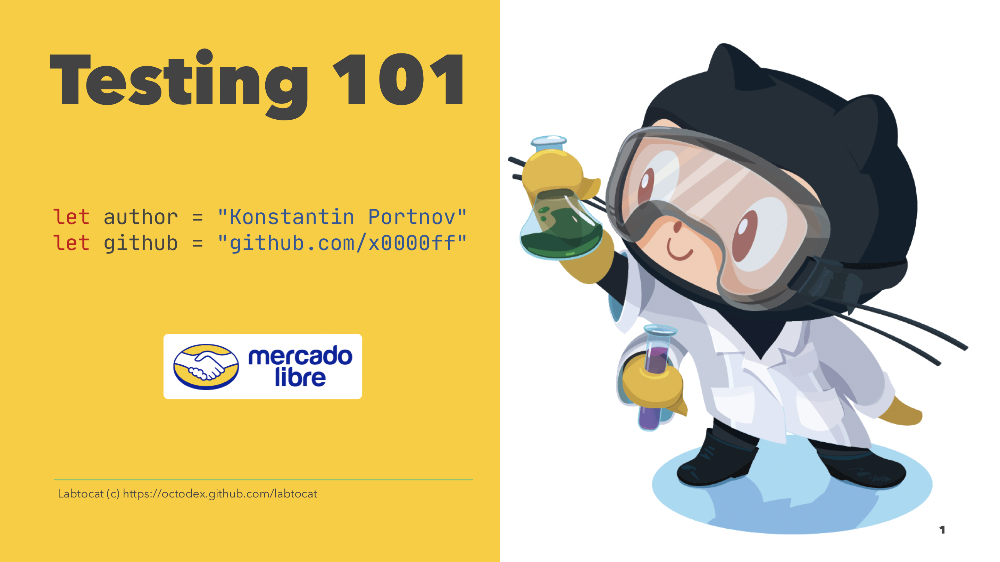

# Testing 101

In this talk we will cover basics of tests:

- 🙃 What is testing?
- 🧐 Why to test?
- 😒 When to test?
- 🤓 How to test?
- 😜 And tiny practice 

## Output

- [PDF](./Testing%20101.pdf)
- [Markdown](./Testing%20101.md)

> ❤️ Presentation was made with [Deckset](https://www.decksetapp.com) and [MacDown](https://macdown.uranusjr.com/)
