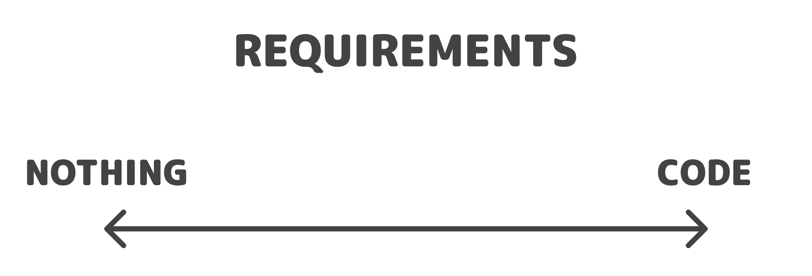
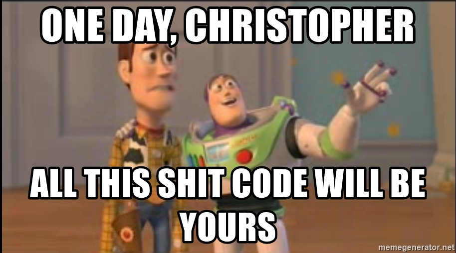
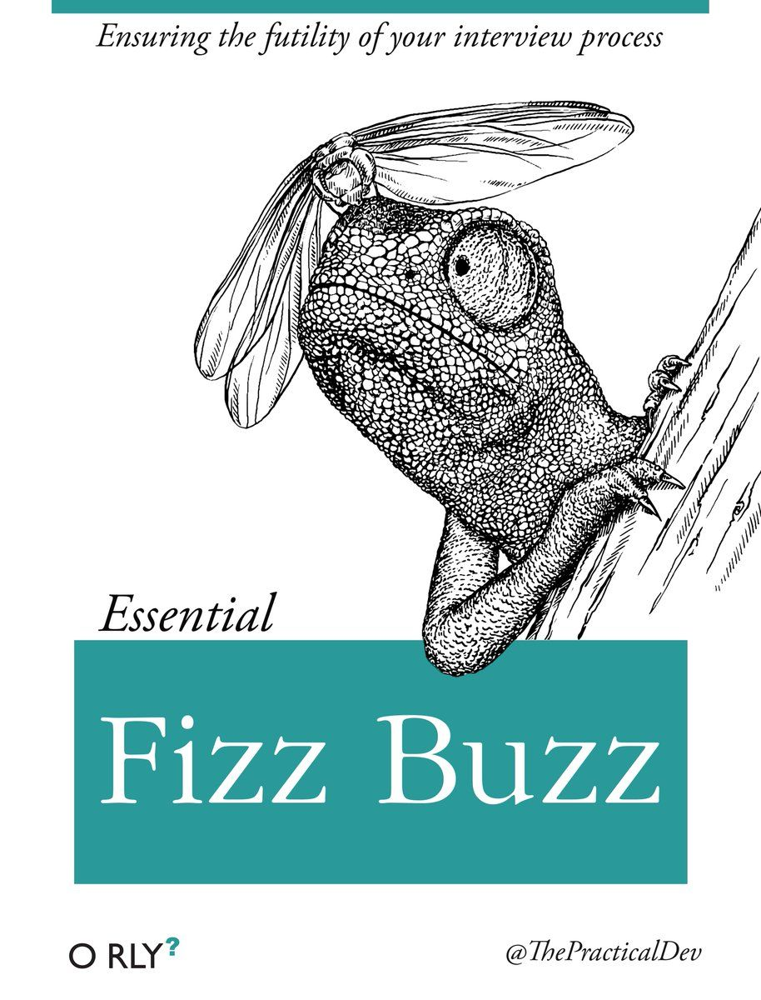
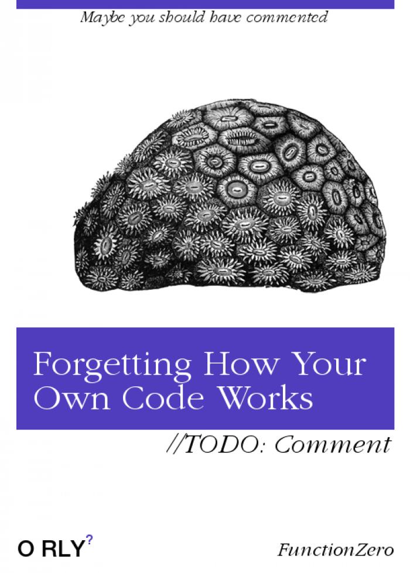
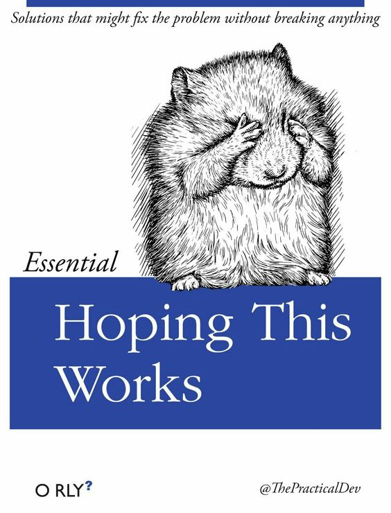
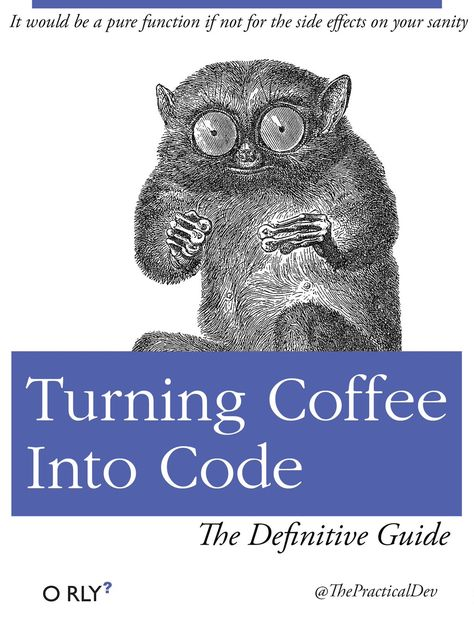
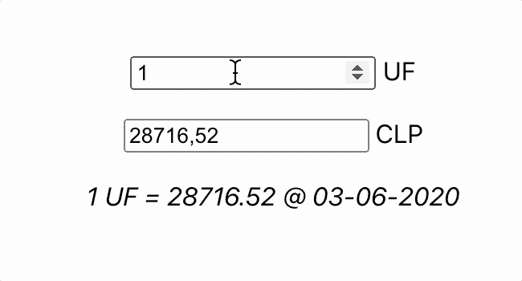

autoscale: true  
slidenumbers: true  
theme: MercadoLibre

# [fit]Testing 101

<br/>

```swift
let author = "Konstantin Portnov"
let github = "github.com/x0000ff"
```

[^ ]


[^ ]: Labtocat (c) https://octodex.github.com/labtocat

---

# First things first

1. Ask at any time
2. Yes, I will share the slides
3. Yes, I know that you know about tests

---

# If you didn't test how do you know it works?...


---

# Do you understand what needs to be done?


---


---



---


---

# La Brea Tar Pits


---
# The Mythical Man-Month


---

# 🧐 Why to test?

[.code-highlight: 1]

```
1. We don't like sh*tty code
```


	
---

# 🧐 Why to test?

[.code-highlight: 2]

```
1. We don't like sh*tty code
2. To sleep well
```


	
---

# 🧐 Why to test?

[.code-highlight: 3-6]

```
1. We don't like sh*tty code
2. To sleep well
3. Discover requirements
```

<br/>

- Dividable by 3 -> "Fizz"
- Dividable by 5 -> "Buzz"
- by 3 and 5 -> "FizzBuzz"



---

# 🧐 Why to test?

[.code-highlight: 4]

```
1. We don't like sh*tty code
2. To sleep well
3. Discover requirements
4. Documentation
```



---

# 🧐 Why to test?

[.code-highlight: 5-6]

```
1. We don't like sh*tty code
2. To sleep well
3. Discover requirements
4. Documentation
5. Move fast or die
	- Who said Lotus?
```


---

# 😒 When to test?

[.code-highlight: 1]

```
1. You have regression bugs
```


---

# 😒 When to test?

[.code-highlight: 2]

```
1. You have regression bugs
2. You are scared to change the code
```



---

# 😒 When to test?

[.code-highlight: 3]

```
1. You have regression bugs
2. You are scared to change the code
3. High cost of failure
```
---

# 😒 When to test?

[.code-highlight: 4-7]

```
1. You have regression bugs
2. You are scared to change the code
3. High cost of failure
4. Long Time To Market
	- Mobile Apps
	- Desktop Apps
	- Embedded
```



---

# 🤓 How to test?

[.code-highlight: 1]

```
1. Unit testing
```


---

# 🤓 How to test?

[.code-highlight: 2]

```
1. Unit testing
2. UI / Screenshot testing	
```


---

# 🤓 How to test?

[.code-highlight: 3]

```
1. Unit testing
2. UI / Screenshot testing	
3. Integration testing
```


---

# 🤓 How to test?

[.code-highlight: 4]

```
1. Unit testing
2. UI / Screenshot testing	
3. Integration testing
4. End to End testing
```


---

# 🤓 How to test?

[.code-highlight: 5]

```
1. Unit testing
2. UI / Screenshot testing	
3. Integration testing
4. End to End testing
5. Test Driven Development
```


---

# 🧘🏽‍♀️ Yes! 
# It hurts at the beginning!

---

# 👴🏻💰 Testing it's like investing

---

# 🧗🏻‍♂️ Tests force you 
# to create better code

---

# 💣 Comment
# something and a test
# should fail

---

# 💩 100% coverage can be 100% fake
### It doesn't make sense a test which just "executes" the line

---

# Simple Code 
# = 
# Simple Test 

---

# 🖖🏼 In [S.O.L.I.D.](https://en.wikipedia.org/wiki/SOLID) We Trust

---

# 🤖 Humans shouldn't test things	 which machines can test

---

# 🕵🏻‍♂️ The test doesn't find the bug
# 👨🏻‍💻 A **human** finds the bug

---

# 🙃 The 1st thing we need to do is change the way we think

---

# 😜 Ready for some practice?[^*]



[^*]: `https://mindicador.cl/api/uf/DD-MM-YYYY`

---

# 🔪 Divide et impera

1. Network operation
2. Process Network response
3. Convert 
	3.1. **UF** ↔ **CLP**
	3.2. **CLP** ↔ **UF**
4. Format amount
...

- Cache network communication
- Localization
- Notify user on errors:
	- Networking
	- Math ( divide by 0 etc.)
- UI / Layout


---


# 🤔 Q & A

---

# **Me...**


-  Konstantin Portnov 

-  [http://about.me/x0000ff](http://about.me/x0000ff)

-  [https://github.com/x0000ff](https://github.com/x0000ff)

-  [https://twitter.com/x0000ff](https://twitter.com/x0000ff)

-  [https://www.linkedin.com/in/KonstantinPortnov](https://www.linkedin.com/in/KonstantinPortnov)

---

# 🙂 You can find this talk here:
# `http://bit.ly/`
# `3dvFvFQ`[^**]


[^**]: https://github.com/x0000ff/Testing101

---

# ☺️ Thanks a lot!


---

# EOF
# 🍻